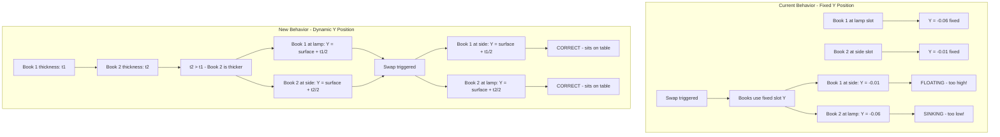

# Fix: Z-Axis Position Issue During Book Swap

## Problem Description

When two 3D books swap positions, the Y-axis (height) position is not adjusted based on each book's thickness. This causes:

1. **Thinner book** placed in a thicker book's slot → appears to **float** above the table
2. **Thicker book** placed in a thinner book's slot → appears to **sink** into the table

## Root Cause Analysis

### Current Implementation

From [`Hero.tsx`](src/components/Hero.tsx:34-41):
```typescript
const BOOK_POSITION: [number, number, number] = [0.5, -0.06, -0.01];  // Book 1 (thinner)
const BOOK2_POSITION: [number, number, number] = [1.3, -0.01, 0.9];   // Book 2 (thicker)
```

The Y positions are hardcoded:
- Book 1: Y = -0.06 (lower because thinner)
- Book 2: Y = -0.01 (higher because thicker)

### Why This Happens

The `BOOK_SLOT_TRANSFORMS` in [`Hero.tsx`](src/components/Hero.tsx:141-152) stores fixed positions for each slot:

```typescript
const BOOK_SLOT_TRANSFORMS: Record<BookSlot, BookSlotTransform> = {
  lamp: { position: BOOK_POSITION, ... },
  side: { position: BOOK2_POSITION, ... },
};
```

When books swap, they use the slot's fixed Y position regardless of their actual thickness.

### Book Thickness Calculation

From [`Book3D.tsx`](src/components/Book3D.tsx:1030-1052), `totalStackDepth` is calculated based on:
- `PAGE_DEPTH = 0.005` per page
- `COVER_DEPTH = 0.05` per cover
- `STACK_GAP = 0.0009` between pages
- Number of pages: Book 1 has ~18 pages, Book 2 has ~42 pages

## Solution Design

### Approach: Dynamic Y Offset Based on Book Thickness

The key insight is that the Y position should be calculated as:
```
Y = base_surface_y + (thickness / 2)
```

Where `base_surface_y` is the position where the bottom of the book touches the table surface.

### Implementation Steps

#### Step 1: Add `onThicknessChange` Callback to Book3D

Add a new prop to [`Book3D.tsx`](src/components/Book3D.tsx:959-983):

```typescript
export interface Book3DProps extends GroupProps {
  // ... existing props
  /** Callback fired when book thickness changes */
  onThicknessChange?: (thickness: number) => void;
}
```

Inside Book3D component, call this callback when `totalStackDepth` changes:

```typescript
useEffect(() => {
  onThicknessChange?.(totalStackDepth);
}, [totalStackDepth, onThicknessChange]);
```

#### Step 2: Track Book Thickness in InteractiveBooks

In [`Hero.tsx`](src/components/Hero.tsx:361-521), add state to track each book's thickness:

```typescript
const [book1Thickness, setBook1Thickness] = useState<number>(0);
const [book2Thickness, setBook2Thickness] = useState<number>(0);
```

#### Step 3: Calculate Dynamic Y Position

Define base surface Y for each slot (the Y position where book bottom touches table):

```typescript
// Base surface Y positions (where bottom of book touches table)
const LAMP_SLOT_SURFACE_Y = -0.06;  // Calibrated for Book 1
const SIDE_SLOT_SURFACE_Y = -0.01;  // Calibrated for Book 2
```

Create a function to calculate Y position based on book thickness:

```typescript
const calculateBookY = (slot: BookSlot, bookThickness: number) => {
  const surfaceY = slot === 'lamp' ? LAMP_SLOT_SURFACE_Y : SIDE_SLOT_SURFACE_Y;
  // Y position = surface Y + half thickness (since Y is center of book)
  return surfaceY + bookThickness / 2;
};
```

#### Step 4: Update BookSlotTransform Interface

Modify `BookSlotTransform` to support dynamic Y calculation:

```typescript
interface BookSlotTransform {
  position: [number, number, number];  // X, baseY, Z (Y will be adjusted)
  rotation: [number, number, number];
  scale: number;
}

// Helper to get transform with adjusted Y
const getSlotTransformForBook = (
  slot: BookSlot, 
  bookThickness: number
): BookSlotTransform => {
  const baseTransform = BOOK_SLOT_TRANSFORMS[slot];
  const adjustedY = calculateBookY(slot, bookThickness);
  return {
    ...baseTransform,
    position: [baseTransform.position[0], adjustedY, baseTransform.position[2]],
  };
};
```

#### Step 5: Update Animation Logic

Modify the `applySwapPose` function in [`Hero.tsx`](src/components/Hero.tsx:437-462) to use dynamic Y positions:

```typescript
const applySwapPose = (bookId: BookId, group: Group, thickness: number) => {
  const startSlot = getSlotForBook(bookId, swapAnimation.spotlightBeforeSwap);
  const endSlot: BookSlot = startSlot === 'lamp' ? 'side' : 'lamp';
  
  const startTransform = getSlotTransformForBook(startSlot, thickness);
  const endTransform = getSlotTransformForBook(endSlot, thickness);
  
  // ... rest of animation logic
};
```

## Visual Diagram



## Files to Modify

1. **[`src/components/Book3D.tsx`](src/components/Book3D.tsx)**
   - Add `onThicknessChange` prop to interface
   - Add useEffect to call callback when `totalStackDepth` changes

2. **[`src/components/Hero.tsx`](src/components/Hero.tsx)**
   - Add state for tracking book thickness
   - Add `calculateBookY` function
   - Update `BookSlotTransform` logic
   - Update `applySwapPose` to use dynamic Y
   - Pass `onThicknessChange` callbacks to Book3D components

## Testing Checklist

- [ ] Book 1 at lamp slot sits correctly on table
- [ ] Book 2 at side slot sits correctly on table
- [ ] After swap: Book 1 at side slot sits correctly (no floating)
- [ ] After swap: Book 2 at lamp slot sits correctly (no sinking)
- [ ] Animation is smooth during swap
- [ ] No regression in other book behaviors (page turning, etc.)
