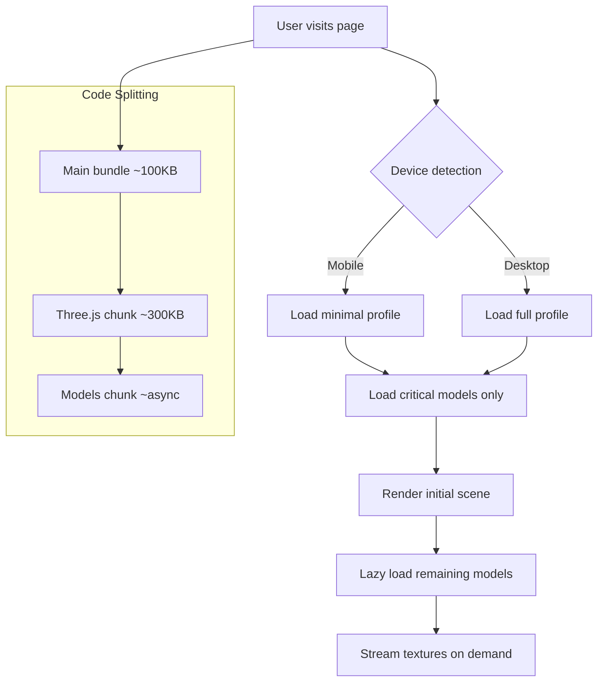

# Performance Optimization Plan

## Problem Analysis

Based on the Lighthouse performance metrics provided:

| Category | Time Spent |
|----------|------------|
| Script Evaluation | 2,755 ms |
| Other | 1,474 ms |
| Garbage Collection | 1,375 ms |
| Script Parsing & Compilation | 566 ms |
| Style & Layout | 21 ms |
| Parse HTML & CSS | 9 ms |
| Rendering | 3 ms |

**Primary Bottleneck: JavaScript Execution** - The main thread is spending 2.7+ seconds on script evaluation alone, indicating a large JavaScript bundle and heavy initialization code.

---

## Root Cause Analysis

### 1. Large JavaScript Bundle
- **Three.js ecosystem**: The combined size of `three`, `@react-three/fiber`, `@react-three/drei`, and `@react-three/postprocessing` is substantial (~500KB+ gzipped)
- **Monolithic component**: [`Hero.tsx`](src/components/Hero.tsx) is ~1,800 lines with all 3D scene logic in one file
- **No code splitting**: All 3D code loads upfront regardless of whether it's needed

### 2. Heavy 3D Model Assets
| Model | Size |
|-------|------|
| antique_globe.glb | 6.5 MB |
| desk_name_plaque_2_kinds.glb | 3.5 MB |
| mahogany_table/scene.gltf + textures | ~8 MB |
| old_desk_lamp/scene.gltf + textures | ~18 MB |
| mini_plant/scene.gltf + textures | ~5 MB |
| **Total** | **~40+ MB** |

### 3. Book3D Component Overhead
- **Desktop profile**: 5 books with 40+32+28+36 pages = 136+ page meshes
- **Each page**: 30 bone segments, 6 materials, skinned geometry
- **useFrame hooks**: Running on every page every frame
- **Memory pressure**: Creating 136+ SkinnedMesh objects with bones

### 4. Texture Loading
- 16+ high-resolution photos (~500KB-1MB each)
- All textures potentially loaded via `useTexture` synchronously
- No progressive loading strategy

---

## Optimization Strategy

### Phase 1: Code Splitting & Lazy Loading (High Impact)

#### 1.1 Dynamic Import for Hero Component
Split the 3D scene into a dynamically loaded component:

```typescript
// src/app/page.tsx
import dynamic from 'next/dynamic';

const Hero = dynamic(() => import('@/components/Hero'), {
  ssr: false,
  loading: () => <HeroLoader />,
});
```

#### 1.2 Lazy Load Three.js Dependencies
Use dynamic imports for heavy Three.js modules:

```typescript
// Instead of static imports
const { EffectComposer, Bloom, Vignette } = await import('@react-three/postprocessing');
```

#### 1.3 Next.js Webpack Configuration
Configure chunk splitting for Three.js:

```typescript
// next.config.ts
const nextConfig: NextConfig = {
  webpack: (config, { isServer }) => {
    if (!isServer) {
      config.optimization.splitChunks = {
        chunks: 'all',
        cacheGroups: {
          three: {
            test: /[\\/]node_modules[\\/](three|@react-three)[\\/]/,
            name: 'three',
            priority: 10,
          },
        },
      };
    }
    return config;
  },
};
```

---

### Phase 2: 3D Model Optimization (High Impact)

#### 2.1 Model Compression
- Use **Draco compression** for all GLTF/GLB models
- Target: 60-80% size reduction
- Tools: `gltf-transform` or `gltf-pipeline`

```bash
# Example compression command
gltf-transform draco antique_globe.glb antique_globe_compressed.glb
```

#### 2.2 Lazy Model Loading
Implement progressive model loading based on visibility:

```typescript
// Use Suspense boundaries for each model group
<Suspense fallback={null}>
  <AntiqueGlobe />
</Suspense>
```

#### 2.3 Level of Detail (LOD)
- Create low-poly versions for distant objects
- Use `useLOD` from drei for automatic switching

#### 2.4 Model Preloading Strategy
Change from synchronous preload to priority-based loading:

```typescript
// Remove immediate preload
// CORE_MODEL_PATHS.forEach(path => useGLTF.preload(path));

// Instead, preload critical models only
useGLTF.preload('/models/mahogany_table/scene.gltf');
useGLTF.preload('/models/old_desk_lamp/scene.gltf');
```

---

### Phase 3: Book3D Component Optimization (Medium-High Impact)

#### 3.1 Reduce Bone Count Per Page
Current: 30 segments per page
Proposed: 8-12 segments for most pages, 20 for covers

```typescript
// In Book3D.tsx, reduce PAGE_SEGMENTS
const PAGE_SEGMENTS = 12; // Down from 30
const COVER_SEGMENTS = 20; // Dedicated for covers
```

#### 3.2 Page Pooling / Virtualization
Only render visible pages:

```typescript
// Only render pages within view distance
const visiblePages = activePages.filter((_, index) => 
  Math.abs(index - currentPage) <= VISIBLE_PAGE_RADIUS
);
```

#### 3.3 Optimize useFrame Hooks
- Skip frames for settled pages (already partially implemented with `idleRef`)
- Use shared animation loop instead of per-page useFrame

#### 3.4 Material Instancing
Share materials across pages instead of creating new ones:

```typescript
// Create shared materials outside Page component
const sharedPageMaterials = useMemo(() => createSharedMaterials(), []);
```

---

### Phase 4: Texture Optimization (Medium Impact)

#### 4.1 Image Compression
- Convert JPEGs to WebP/AVIF
- Use responsive image sizes
- Implement progressive loading

#### 4.2 Texture Streaming
Load textures based on page proximity:

```typescript
// Already partially implemented with textureLoadRadius
// Optimize the radius based on device capability
const textureLoadRadius = isLowEndDevice ? 2 : 4; // Reduced from 8
```

#### 4.3 Texture Atlas
Combine small textures into a single atlas to reduce draw calls.

---

### Phase 5: Memory Management (Medium Impact)

#### 5.1 Dispose Resources
Ensure proper cleanup of Three.js resources:

```typescript
useEffect(() => {
  return () => {
    geometry.dispose();
    material.dispose();
    texture.dispose();
  };
}, []);
```

#### 5.2 Object Pooling
Reuse geometry and material objects instead of recreating.

#### 5.3 Reduce Garbage Collection Pressure
- Avoid creating new objects in useFrame
- Use object pools for Vector3, Matrix4 temporaries

---

### Phase 6: Scene Profile Optimization (Low-Medium Impact)

#### 6.1 More Aggressive Mobile Profile
```typescript
mobile: {
  dpr: [0.5, 0.75],  // Reduced from [0.75, 1]
  pageSegments: 6,    // Fewer bones per page
  sheetCount: 8,      // Fewer pages
}
```

#### 6.2 Progressive Enhancement
Start with minimal scene, add details progressively:

```typescript
// Load basic scene first
// Then progressively add:
// - Additional books
// - Steam effect
// - Plant
// - Globe
```

---

## Implementation Priority

| Priority | Task | Estimated Impact | Effort |
|----------|------|------------------|--------|
| 1 | Code splitting for Hero component | High | Low |
| 2 | Next.js webpack chunk configuration | High | Low |
| 3 | Draco compression for models | High | Medium |
| 4 | Reduce page bone count | Medium-High | Low |
| 5 | Page virtualization | Medium-High | Medium |
| 6 | Lazy model loading | Medium | Medium |
| 7 | Texture compression | Medium | Low |
| 8 | Material instancing | Medium | Medium |
| 9 | Memory cleanup | Low-Medium | Low |

---

## Expected Results

After implementing all optimizations:

| Metric | Before | After (Est.) |
|--------|--------|--------------|
| Script Evaluation | 2,755 ms | ~800-1,200 ms |
| Script Parsing | 566 ms | ~200-300 ms |
| Garbage Collection | 1,375 ms | ~400-600 ms |
| Total Blocking Time | ~6,000 ms | ~2,000-3,000 ms |

---

## Architecture Flow



---

## Files to Modify

1. [`next.config.ts`](next.config.ts) - Add webpack chunk splitting
2. [`src/app/page.tsx`](src/app/page.tsx) - Dynamic import for Hero
3. [`src/components/Hero.tsx`](src/components/Hero.tsx) - Lazy loading, model optimization
4. [`src/components/Book3D.tsx`](src/components/Book3D.tsx) - Bone reduction, page virtualization
5. All model files in `public/models/` - Draco compression

---

## Notes

- All optimizations preserve existing visual and logic flows
- Changes are backward compatible
- Progressive enhancement ensures mobile users get fast experience
- Desktop users get enhanced experience after initial load
